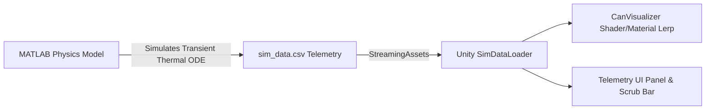

# Ksheera-Raksha: Milk Chilling Can Digital Twin & 3D Thermal Visualization

**Ksheera-Raksha** is an IoT-enabled, low-cost, lightweight milk chilling digital twin developed for small-scale dairy farmers. The project combines a 5-layer lumped-capacitance transient thermal physics simulation (developed in MATLAB) with an interactive 3D real-time visualization in Unity URP.

---

## 📌 Project Overview & Purpose

In rural dairy supply chains, raw harvested milk rapidly spoils due to high ambient temperatures ($35\,^\circ\text{C}$) during transport. **Ksheera-Raksha** introduces a passive/hybrid chilling can utilizing an integrated Phase Change Material (PCM) thermal storage jacket combined with polyurethane insulation.

### The 5-Layer Concentric Thermal Structure
$$\text{Ambient Environment } (35\,^\circ\text{C}) \xrightarrow{\quad R_{\text{ins}} = 0.80\text{ K/W} \quad} \text{Outer HDPE/Steel Shell} \rightarrow \text{Polyurethane Insulation} \rightarrow \text{PCM Jacket} \rightarrow \text{Inner Steel Liner} \rightarrow \text{Milk Core } (20\text{ L})$$

---

## 🛠 System Architecture & Workflow



1. **Physics & Simulation (MATLAB R2026a):** Solves the coupled differential equations governing ambient heat influx ($\dot{Q}_{\text{amb}}$) and latent heat absorption of the PCM jacket ($\dot{Q}_{\text{pcm}}$).
2. **Telemetry Export:** Exports time-series data (`sim_data.csv`) tracking time, conventional milk temperature, and PCM-insulated milk temperature over a 12-hour transport window.
3. **Unity 3D Digital Twin (Unity 2022+ URP):** Renders a live side-by-side comparison of the Conventional Can vs. Ksheera-Raksha Can with real-time temperature-to-color mapping and interactive playback controls.

---

## 🎨 Unity Visualization Design & Configuration

The Unity visualization was built with deliberate graphics and engine configurations tailored specifically for data-driven heat map rendering:

### 1. Linear Color Space (`Edit → Project Settings → Player → Color Space → Linear`)
* **Why it matters:** In Gamma color space, `Color.Lerp(blue, red, t)` produces non-linear perceptual midpoint shifts (appearing muddy or overly saturated). Linear color space guarantees physically correct gradient blending, ensuring the visual heat map accurately reflects temperature variations.

### 2. Universal Render Pipeline (URP)
* Enables seamless handling of base color lerping and emission properties for high-contrast visual cues during pitch presentations.

### 3. Frame-Rate Independent Playback (`Time.deltaTime`)
* Time scrubbing advances via `simTime += Time.deltaTime * playbackSpeed` inside `Update()`. This decouples data playback from Unity's `FixedUpdate` physics step, ensuring smooth, stutter-free playback across varying hardware.

### 4. Robust Script Execution Order & Data Lifecycle
* Data loading (`SimDataLoader`) parses `sim_data.csv` in `Awake()`, guaranteeing that temperature datasets are fully available before `CanVisualizer` and `TelemetryPanel` initialize in `Start()`.

### 5. Cross-Platform Data Architecture (`StreamingAssets`)
* CSV telemetry files are loaded dynamically from `Assets/StreamingAssets/sim_data.csv`, enabling easy dataset swapping without recompiling scripts.

### 6. Screen-Space Dashboard UI
* Live digital readouts ($^\circ\text{C}$), safety threshold markers ($10\,^\circ\text{C}$ limit), and scrubber controls are rendered in **Screen Space – Overlay** for clear, camera-independent dashboard monitoring.

---

## 📂 Repository Structure

```
MilkCanTemperatureVisualization/
├── Assets/
│   ├── Scripts/
│   │   ├── CanVisualizer.cs       # Drives color lerping and dynamic material properties
│   │   ├── SimDataLoader.cs       # Parses MATLAB simulation telemetry CSV data
│   │   └── TelemetryPanel.cs      # Controls playback, time scrub bar, and digital UI readouts
│   ├── StreamingAssets/
│   │   └── sim_data.csv           # Exported thermal simulation time-series dataset
│   └── material/                  # Materials for Cans, PCM Jacket, Outer Shell & Fluid
├── MILK_CHILLING_DIGITAL_TWIN_PHYSICS.md # Complete mathematical derivations & parameter specs
├── .gitignore                     # Unity-optimized Git ignore configuration
└── README.md                      # Project documentation
```

---

## 📊 Key Results & Performance

| Parameter | Conventional Can | Ksheera-Raksha Can |
| :--- | :---: | :---: |
| **Initial Milk Temp** | $30\,^\circ\text{C}$ | $30\,^\circ\text{C}$ |
| **Ambient Temp** | $35\,^\circ\text{C}$ | $35\,^\circ\text{C}$ |
| **Time to Exceed $10\,^\circ\text{C}$** | $< 1 \text{ Hour}$ | **$> 6 \text{ Hours}$** |
| **Thermal Protection** | None | Insulated Polyurethane ($R = 0.80\text{ K/W}$) + Organic PCM ($L_{\text{pcm}} = 250\text{ kJ/kg}$) |

---

## 🚀 Getting Started

1. **Clone the Repository:**
   ```bash
   git clone https://github.com/ANIL6190/Ksheera-Raksha.git
   ```
2. **Open in Unity:** Open the project directory in **Unity 2022.3 LTS** or newer (URP template).
3. **Run the Simulation:** Open `Assets/Scenes/SampleScene.unity` (or main scene) and press **Play** to observe the real-time thermal visualization.
